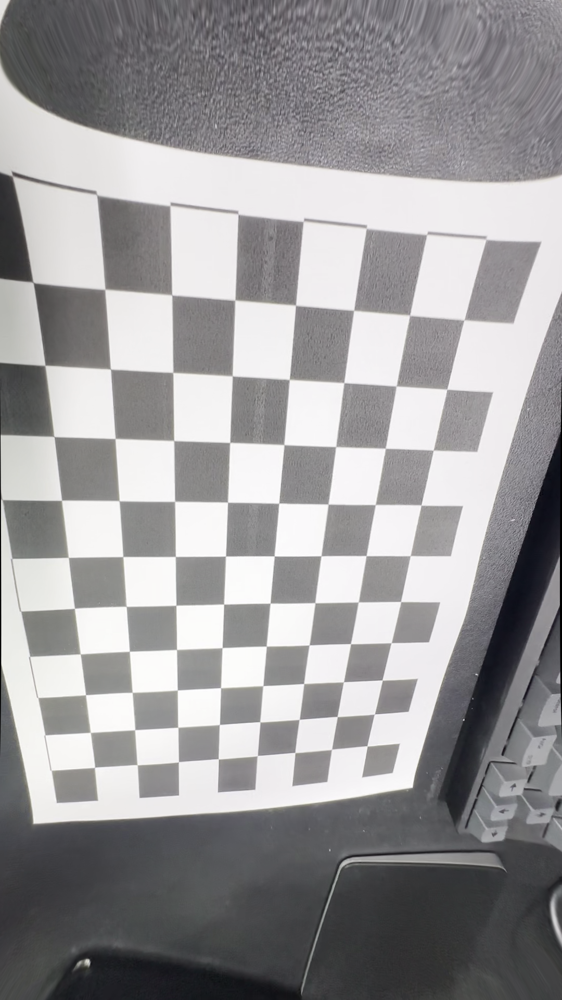

## Camera Calibration and Distortion Correction
This project performs camera calibration and distortion correction using a chessboard pattern. It finds the chessboard pattern in a given video to compute the camera's intrinsic parameters and distortion coefficients, and uses these to correct distortion in images.

## Usage
Run calibration.py. This script performs camera calibration using a chessboard pattern found in ./test.mp4.
The calibration results are printed to the terminal. You can check information such as the camera matrix, distortion coefficients, and RMS error.
Selected images are corrected for distortion and saved as Original_Image_{i+1}.png and Undistorted_Image_{i+1}.png.

## Results
The calibration results in test.mp4 are as follows:

* The number of selected images = 2
* RMS error = 1.3164623370235768
* Camera matrix (K) = 
[[8.35938873e+02 0.00000000e+00 5.02968733e+02]
 [0.00000000e+00 9.91462303e+02 1.01921576e+03]
 [0.00000000e+00 0.00000000e+00 1.00000000e+00]]
* Distortion coefficient (k1, k2, p1, p2, k3, ...) = [ 0.00802721  0.04784535  0.00355404  0.00280947 -0.13025702]

The original and undistorted images are shown below:

<blockquote>

